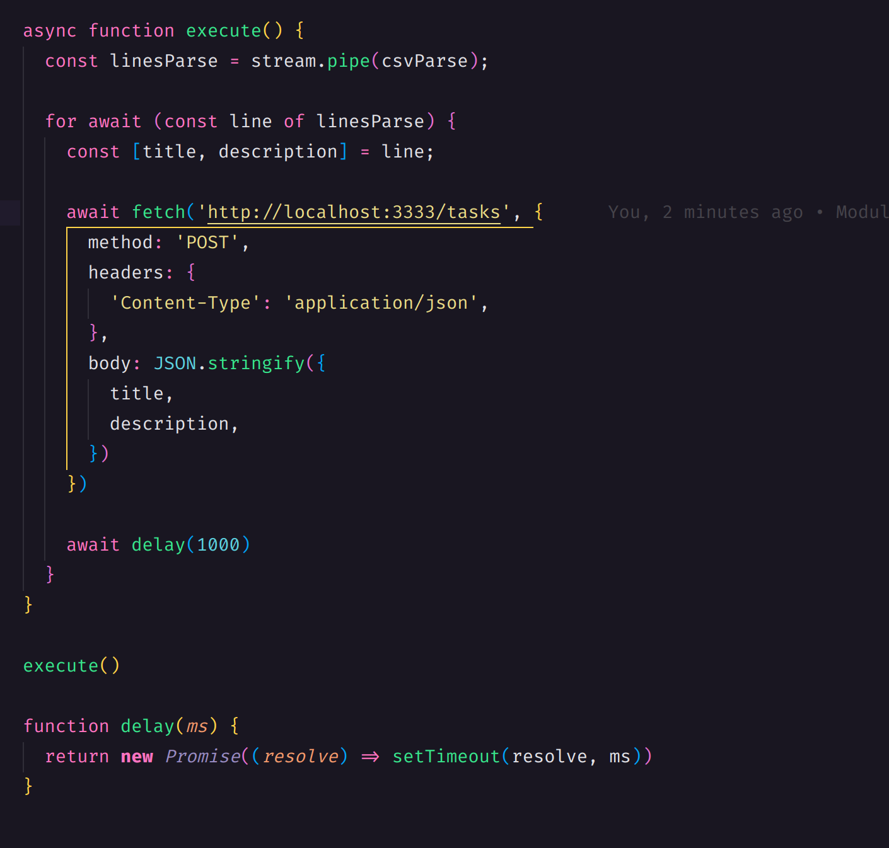

  

# Tasks Backend

O projeto desenvolvido é uma API básica em NodeJS que realiza operações de CRUD (Create, Read, Update, Delete) em uma coleção de tarefas (tasks). A API foi construída sem a utilização de frameworks e utiliza conceitos fundamentais do NodeJS, como módulos nativos e Streams.

Uma das funcionalidades interessantes implementadas no projeto é a integração com Streams. As Streams são fluxos de dados que permitem a leitura e escrita de informações de forma eficiente e assíncrona. Nesse caso, foi utilizado um exemplo de leitura de um arquivo CSV usando Streams.

Ao ler o arquivo CSV por meio de Streams, é possível processar os dados conforme eles vão sendo recebidos, sem a necessidade de carregar todo o conteúdo do arquivo na memória de uma só vez. Isso é particularmente útil quando se trabalha com arquivos grandes, pois evita o consumo excessivo de recursos.

No projeto, a leitura do arquivo CSV por meio de Streams permitiu que os dados fossem processados e inseridos na coleção de tarefas de forma mais eficiente, evitando gargalos de desempenho e possíveis problemas de memória.

---

Feito com ♥ by joaoD3V